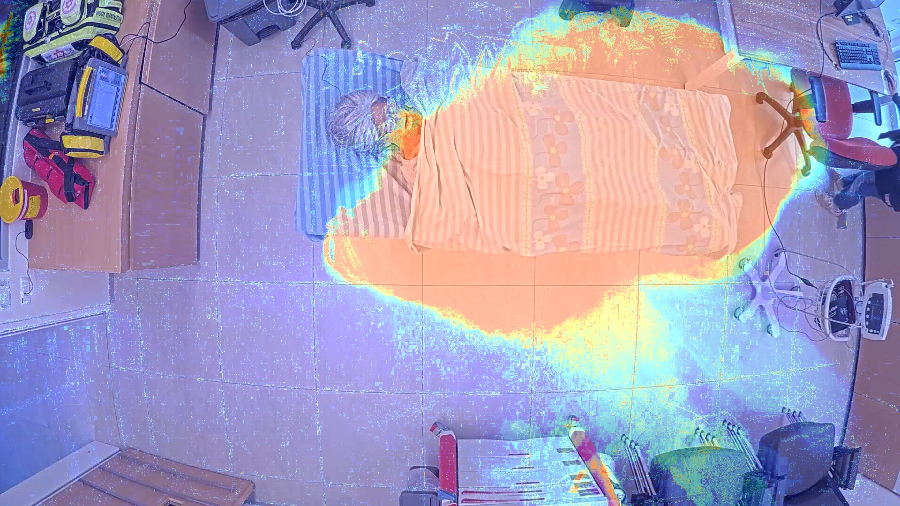

# Heatmap-Based Motion Analysis for Nurse Activity Monitoring  

## Overview  

Heatmap motion analysis was developed to analyze and visualize nurse movement patterns in an emergency room setting. By processing video footage from patient rooms, the system generates heatmaps that highlight the frequency and intensity of nurse presence around the patient.  

The goal of this project is to gain insights into nurse-patient interactions and identify behavioral patterns that could contribute to improving patient care and hospital workflow efficiency.  

## Purpose and Motivation  

In emergency and critical care settings, analyzing nurse workflows is essential for improving patient care and optimizing hospital operations. This project provides a data-driven approach to studying nurse activity by:

- Evaluating how nurses move and interact within the patient’s room.  
- Identifying patterns in nurse behavior during different stages of treatment.  
- Analyzing time spent in key areas, such as near the patient’s bed or medical equipment.  
- Providing insights into workflow efficiency to enhance hospital resource allocation and patient care strategies.
  
## How It Works  

1. **Video Processing**  
   - Extracts frames from recorded footage of patient rooms.  
   - Uses reference frames to maintain spatial consistency across different recordings.  

2. **Motion Detection**  
   - Applies OpenCV's Background Subtraction (MOG2) to detect motion within the scene.  
   - Identifies and isolates movement patterns related to nurse activity.  

3. **Heatmap Generation**  
   - Aggregates detected motion across all frames.  
   - Applies a color-mapped overlay to highlight areas with the highest nurse activity.  
   - Superimposes the heatmap on the original video frame for easy visualization.  

## Heatmap Example 

The following image shows an example of a generated heatmap overlaid on a patient room. Areas with high activity are shown in warmer colors (yellow/red), while low-activity areas remain cooler (blue).  

  

## Insights and Applications  

This analysis can provide valuable insights into the efficiency and effectiveness of nurse-patient interactions:  

- **Workflow Optimization**: Identifying inefficient movement patterns to enhance hospital procedures.  
- **Training and Evaluation**: Providing data-driven feedback to improve nurse response times and overall patient care.  

## Sample Video  

A sample video showcasing the results of the heatmap analysis can be included here:  

https://github.com/user-attachments/assets/2d0ecf2e-b836-4796-a880-03cefde00129

## Sample GIF  

Here is a sample of the motion heatmap in action:

## Contributors  

This project was developed as part of a data-driven research initiative using Python and OpenCV. 
